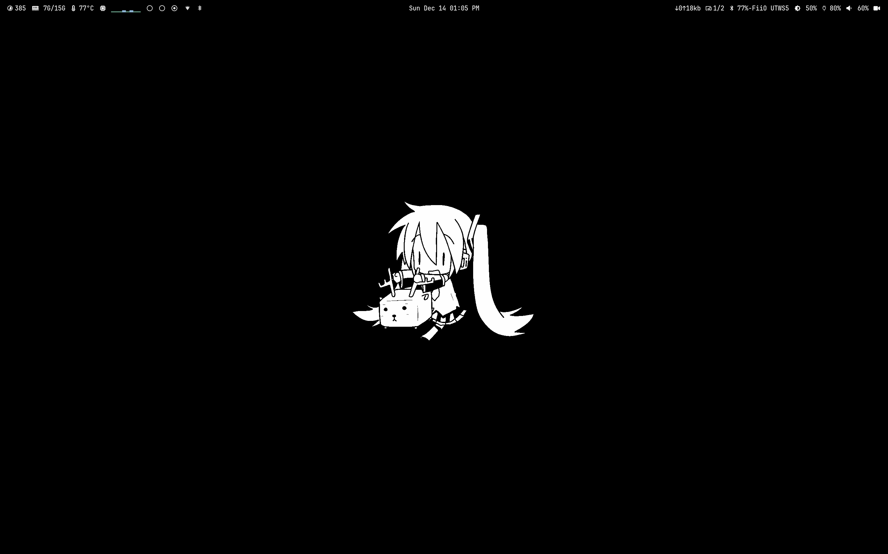
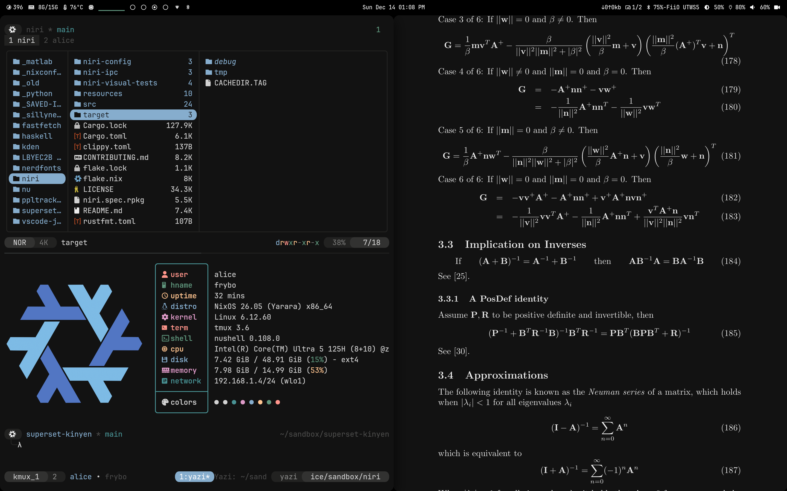
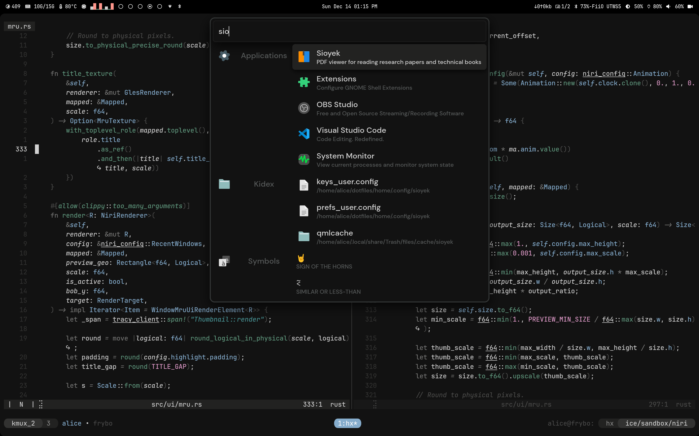
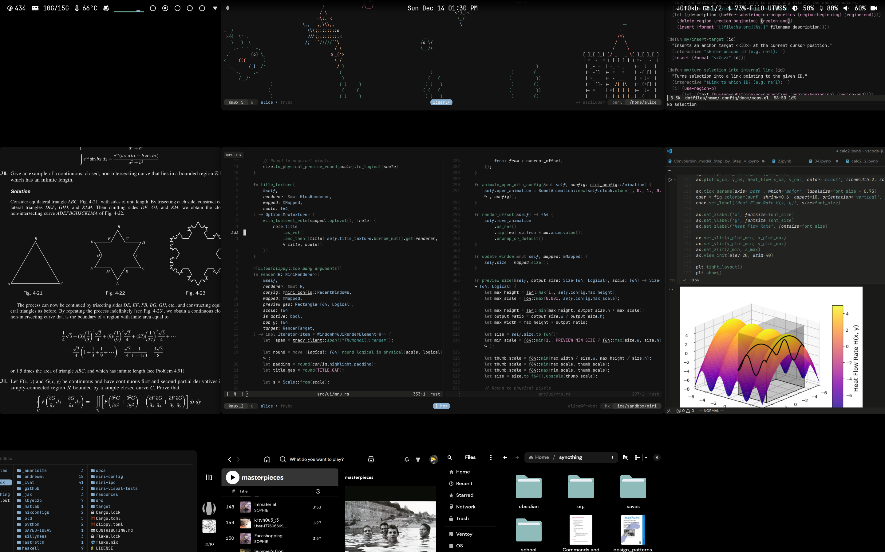

<details>
<summary>Screenshots</summary>



---



---



---



</details>

<details>
<summary>Features</summary>

````
kernel         : 6.12.xx
compositor     : niri
terminal       : kitty+tmux
shell          : nushell (with fish completions)
text editors   : emacs, helix, obsidian
browser        : zen
launcher       : vicinae
themer         : stylix
theme          : rasmus
````

</details>


`tiny preface: this readme handwaves a lot for explanation's sake; pedantism is only useful after the fact.`

This opinionated nixos configuration intends to implement the dendritic pattern as cleanly as possible, with as little verbosity as possible, and as extensibly as possible.

it builds on the [dendritic pattern by mightiam](https://github.com/mightyiam/dendritic) by introducing thin helper functions (see later) without reinventing the wheel (as if flakes or nix itself weren't abstract enough) or using overkill abstractions. the dendritic pattern, combined with nix being a functional language, makes it natural to write small composable functions that expand into modules. this config leans into that.

migrating your traditional nixos config to this should be straightforward after the structure is understood.

# table of contents
- [the dendritic pattern](#the-dendritic-pattern)
- [what this config exclusively provides](#what-this-config-exclusively-provides)
- [how does this configuration work?](#how-does-this-configuration-work)
- [okay, how do i apply this for my nixos system?](#okay-how-do-i-apply-this-for-my-nixos-system)
- [module namespaces](#module-namespaces)
- [why are modules named like that?](#why-are-modules-named-like-that)
- [device modules](#device-modules)
- [helpers](#helpers)
  - [helpers.symlink](#helperssymlink)
  - [helpers.from](#helpersfrom)
- [user dotfiles](#user-dotfiles)
- [home-manager integration](#home-manager-integration)
- [i dont like the helpers, they hide whats being done under the hood](#i-dont-like-the-helpers-they-hide-whats-being-done-under-the-hood)

# the dendritic pattern

traditional nixos configurations are hierarchical. (usually) your `configuration.nix` sits at the top and imports `./hardware-configuration.nix`, `./users/alice.nix`, maybe `./services/docker.nix`. each of those files might import their own dependencies: `./users/alice.nix` could import `./users/programs/shell.nix`, which imports `./users/programs/starship.nix`. the result is a tree of imports where modules pull in other modules.

```nix
imports = [
  ./hardware-configuration.nix
  ./users/alice.nix
  ./services/docker.nix
];
```

this creates several problems. first, to understand what a host actually includes, you have to trace through the import chain. looking at `configuration.nix` doesn't tell you the full picture because each imported file might import more files. second, modules become coupled to their file paths. if you want to reuse `./users/programs/shell.nix` in a different host, you either duplicate the file, create symlinks, or restructure your directories. third, the dependencies between modules are implicit. a module imports what it needs internally, so you can't see from the outside what it depends on.

i.e., it imposes a structure that isn't really useful.

the dendritic pattern inverts this. instead of a tree where modules import other modules, you have a flat collection of independent modules that know nothing about each other. each module is a self-contained unit that declares what it provides, whether that's a program configuration, a service, or a set of packages.

composition happens in exactly one place: the host definition. when you define a host, you explicitly list every module it includes. there's no tracing through files to figure out what's actually enabled. the host definition is the complete picture.

```nix
imports = with modules.nixos; [
  device-ASUS_Zenbook_14_UX3405MA
  user-alice
  feature-niri
  feature-docker
  setting-fonts
  packageSet-shellEnhancements
];
```

directory structure becomes purely organizational. you put modules in `/tree/modules/system/features/` or `/tree/stuff/things/whatever/`; it's irrelevant because `import-tree` flattens everything into one attribute set. reusing a module across multiple hosts is trivial since you just reference it by name in each host definition.

the shift is from "this module pulls in these dependencies" to "these independent modules are composed together here." each module is a standalone capability that can be mixed and matched freely, and the host definition is where you decide which capabilities combine to form a complete system.

# what this config exclusively provides

this config builds on the dendritic pattern with these few additions:

- `library.defineHostModule` and `library.defineUserModule` reduce boilerplate for the most common definitions
- `library.createNixosSystem` wires up a host to `nixosConfigurations` in one line
- `helpers.symlink` symlinks dotfiles from the repo into home directories at activation time, without involving home-manager
- `helpers.from` pins specific modules to different nixpkgs versions

the helpers in particular go surprisingly well with the dendritic pattern (as I rarely found myself taking advantage of nix's language in traditional configs). because modules are just values in an attribute set, you write functions that take modules and return modified modules. `helpers.from` wraps a module and intercepts its `pkgs` argument. `helpers.symlink` generates an activation script module from a few parameters. this pattern is easy to extend: when you repeat yourself, you write a helper that reduces verbosity. the flat structure means your helper just needs to return something that ultimately expands into a module (i.e., by currying), and it'll compose cleanly with everything else.

# how does this configuration work?

before explaining the parts unique to this config itself, going over the pre-made tools that make dendritic configs possible in the first place is useful: `import-tree` and `flake-parts`.

inside flake.nix, you'll see:

```nix
outputs = inputs: inputs.flake-parts.lib.mkFlake {inherit inputs;} (inputs.import-tree ./tree);
```

this is the only output to the flake, because:

- `import-tree` is a simple function which recursively imports each nix file in the passed-in directory, then merges each into one attribute set. so directory structure and nix file naming is irrelevant except for documentation/organization.
- `flake-parts.lib.mkFlake` then takes the merged attribute set and only takes whatever is inside the `flake.*` set, like `flake.foo.bar.xyz`, and flake-parts will expose the attributes inside `flake.*` as outputs.
- this then necessitates wrapping your custom modules in *something* that flake-parts can work with.
- the `/tree/library/flake-parts.nix` file also imports `flake-parts.flakeModules.modules`, which is what enables the `flake.modules.*` pattern used throughout this config.
 
# okay, how do i apply this for my nixos system?

pretty simple! the order goes (not necessarily) like: 

1. define a "typical nixos module"
2. define a "typical home-manager module"
3. define a "user module", pass in your home-manager modules
4. define a "host module", pass in your user module and nixos modules
5. pass the "host module" to `library.createNixosSystem`

you define a module with your typical options found in `man configuration.nix`, but wrap it so that flake-parts can take it like so:

### traditional module

```nix
{inputs, system, ...}: {
    environment.systemPackages = with inputs.niri-flake.packages.${system}; [
      xwayland-satellite-unstable
    ];
    programs.niri = {
      enable = true;
      package = inputs.niri-flake.packages.${system}.niri-unstable;
    };
}
```

### flake-parts module

```nix
# this outer function is a flake-parts module. it receives `inputs` during flake evaluation.
{inputs, ...}: {
  # this inner function is a nixos module; nixosSystem passes it `config`, `lib`, `pkgs`, etc.
  # `system` comes from `pkgs.system`. captures `inputs` from outer scope via closure.
  flake.modules.nixos.feature-niri = {pkgs, ...}: {
    environment.systemPackages = with inputs.niri-flake.packages.${pkgs.system}; [
      xwayland-satellite-unstable
    ];
    programs.niri = {
      enable = true;
      package = inputs.niri-flake.packages.${pkgs.system}.niri-unstable;
    };
  };
}
```

now `feature-niri` is a nixos module we can use in a host definition via `library.defineHostModule`:

```nix
{
  library,
  modules,
  helpers,
  ...
}: {
  flake.modules = library.defineHostModule {
    # name for the host
    name = "frybo";       
    # the stateVersion, i.e., the version of nixos you first installed with
    isoVersion = "25.05"; 
    # regular nixos modules
    imports = with modules.nixos; [
      device-ASUS_Zenbook_14_UX3405MA
      user-alice
      feature-niri
      my-other-system-module-a
      my-other-system-module-b
    ];
  };
}
```

but we still need to define a user; right now, `user-alice` would be invalid:

```nix
{
  library,
  modules,
  ...
}: {
  flake.modules = library.defineUserModule {
    # username
    name = "alice";
    # home-manager version
    homeManagerVersion = "25.05";
    # default shell, must pass in a function
    shell = pkgs: pkgs.nushell;
    # groups the user is included in
    groups = [
      "networkmanager"
      "docker"
      "users"
      "wheel"
      "video"
    ];
    # regular home-manager modules
    imports = with modules.homeManager; [
      feature-zenBrowser
      feature-my-home-program1
      feature-my-home-program2
      setting-stylix
      setting-disableDefaultHomeFolders
      misc-generalServices
    ];
  };
}
```

`defineUserModule` creates two modules from one definition: a nixos module (`modules.nixos.user-alice`) that sets up the system user and wires in home-manager, and a home-manager module (`modules.homeManager.alice`) that contains your imports. it also creates a user group with the same name as the user, so you don't have to set that up separately.

that last step is handled by `library.createNixosSystem` in `main.nix`:

```nix
{library, ...}: {
  flake.nixosConfigurations = 
    {} 
    // (library.createNixosSystem "x86_64-linux" "frybo")
    // (library.createNixosSystem "aarch64-linux" "my-arm-host");
}
```

this looks up `host-<n>` from `modules.nixos` and calls `nixpkgs.lib.nixosSystem` for you.

# module namespaces

flake-parts exposes two module namespaces:

- `flake.modules.nixos.*` for nixos/system-level modules (receives `config`, `pkgs`, `lib`, etc.)
- `flake.modules.homeManager.*` for home-manager modules (receives `config`, `pkgs`, `lib`, uses `home.packages`, `programs.*`, etc.)

when you write `modules.nixos.feature-foo` in a host definition, it refers to `flake.modules.nixos.feature-foo`. same logic for `modules.homeManager.*` in user definitions.

# why are modules named like that?

module names and directory structure are purely semantic and just for keeping track of things (except for the first two):

- `host-foo` is a host definition from `library.defineHostModule` with `name = foo`
- `user-foo` is a user module from `library.defineUserModule` with `name = foo`
- `feature-*` modules add individual functionality (docker, gaming, audio, individual programs). typically uses `programs.X.enable = true` or configures services.
- `setting-*` modules don't add but alter functionality (fonts, locale, nix settings, stylix themes)
- `packageSet-*` modules are groups of related packages. just adds to `environment.systemPackages` or `home.packages` without enabling options.
- `device-*` modules are flake-parts wrapped hardware-configuration.nix from `nixos-generate-config`
- `misc-*` modules are things that don't fit elsewhere (portals, greeter config, general services)

obviously, you're free to ignore this convention entirely.

# device modules

`device-*` modules wrap your `hardware-configuration.nix`. they use `modulesPath` to import nixos's hardware detection:

```nix
{
  flake.modules.nixos.device-MyLaptop = {modulesPath, config, lib, pkgs, ...}: {
    imports = [(modulesPath + "/installer/scan/not-detected.nix")];
    
    boot.initrd.availableKernelModules = ["xhci_pci" "nvme" ...];
    fileSystems."/" = { device = "/dev/disk/by-uuid/..."; fsType = "ext4"; };
    # ... rest of hardware-configuration.nix contents
  };
}
```

hardware-specific stuff like graphics drivers, kernel parameters, and firmware also goes here. keeping it in a device module means you can share the same software configuration across different machines by swapping out the device module.

# helpers

`helpers` is the third argument alongside `library` and `modules`. unlike the other two, it's not for module definitions but for utility functions that expand into modules.

this is where the dendritic pattern pays off. since modules are just values and composition happens in one place, it becomes natural to write functions that generate, wrap, or transform modules. the result slots into your imports list like any other module.


you can add your own helpers in `/tree/helpers/` following this pattern:

```nix
{
  flake.helpers.myHelper = { someArg }: { ... }: {
    # returns a module
  };
}
```

the outer function takes your parameters, the inner function is what the module system calls with its standard arguments. you return an attribute set with whatever nixos options you want to set. i personally found this pattern to encourage leveraging more of nix's language.

## helpers.symlink

creates activation scripts to symlink dotfiles from the repo into the user's home:

```nix
# in a host module's imports
(helpers.symlink {
  from = "/etc/nixos/tree/definitions/users/alice/dotfiles";
  to = "/home/alice";
  user = "alice";
})
```

this recursively symlinks all files from the source into the destination, creating directories as needed. useful for dotfiles that you want to keep in the repo but not manage through home-manager's `home.file`. edits to the files take effect immediately without rebuilding.

## helpers.from

allows you to override the `pkgs` argument for a specific module, letting you pin individual modules to different nixpkgs versions:

```nix
# in a host module's imports
(helpers.from inputs.nixpkgs-stable feature-someThing)
(helpers.from inputs.nixpkgs-master feature-bleedingEdge)
```

you'll need to add the alternative nixpkgs versions as inputs in your `flake.nix`:

```nix
inputs = {
  nixpkgs.url = "github:NixOS/nixpkgs/nixos-unstable";
  nixpkgs-stable.url = "github:NixOS/nixpkgs/nixos-24.11";
  nixpkgs-master.url = "github:NixOS/nixpkgs/master";
  # ...
};
```

and add `inputs` to your host definition's arguments:

```nix
{
  library,
  modules,
  helpers,
  inputs,
  ...
}: { ... }
```

when the nixos module system evaluates your modules, this helper intercepts the arguments, builds an alternative `pkgs` from the provided nixpkgs input, then forwards to the actual module with the substituted `pkgs`. the module receives packages from your specified nixpkgs version, while everything else (`config`, `lib`, etc.) remains unchanged.

this is a good example of what helpers can do. the underlying mechanism is just function composition: wrap the module function, intercept its arguments, modify what you need, pass the rest through. if you find yourself wanting to do something similar (maybe inject a different `lib`, or add default config to every module of a certain type), you can write a helper for it.

# user dotfiles

each user definition lives in `/tree/definitions/users/<n>/` with a `dotfiles/` subdirectory. the `helpers.symlink` helper (used in host definitions) symlinks these into the user's home directory at activation time.

this is an alternative to managing dotfiles through home-manager's `home.file`. the difference is that symlinked dotfiles can be edited in place and the changes take effect immediately, while `home.file` managed files require a rebuild.

# home-manager integration

home-manager is integrated via `feature-homeManager`, which imports the home-manager nixos module with `useGlobalPkgs` and `useUserPackages` enabled. this means home-manager uses the same nixpkgs instance as the system, and user packages are installed to `/etc/profiles/per-user/<user>` rather than `~/.nix-profile`.

the practical effect is that you don't have to worry about nixpkgs version mismatches between system and home-manager packages, and `nix-env` operations won't interfere with your declarative config.

# i dont like the helpers, they hide whats being done under the hood

the helpers themselves aren't verbose. here's what `library`, `modules`, and `helpers` actually are.

in `/tree/library/library.nix`:

```nix
{
  inputs,
  lib,
  ...
}: {
  config = {
    _module.args = {
      inherit (inputs.self) library modules helpers;
    };
    # ...
  };
}
```

`_module.args` is a low-level attribute whose contents are passed as arguments to the module system. [more info here](https://discourse.nixos.org/t/how-to-inject-custom-module-arguments/30327).

what's happening is: `inputs.self.library`, `inputs.self.modules`, and `inputs.self.helpers` are all exposed by flake-parts as flake outputs. by adding them to `_module.args`, they become available as function arguments to every module in the config. that's why you can write `{library, modules, helpers, ...}:` at the top of any module file without explicitly importing anything.

if you want to see exactly what `defineHostModule` or `defineUserModule` do, they're defined in the same file. they're short functions that return attribute sets in the shape that flake-parts and nixos expect.
